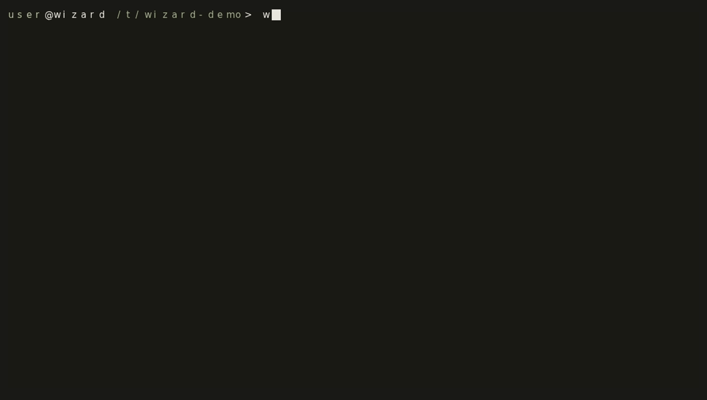

# Wizard

The fastest agent in your terminal: one Rust binary, any model, at its prompt before the others have finished loading.

## Install

```bash
# Linux and macOS
curl -fsSL https://raw.githubusercontent.com/teddytennant/wizard/main/install.sh | bash

# Homebrew
brew install teddytennant/tap/wizard

# Nix
nix run github:teddytennant/wizard

# Arch: not on the AUR yet, build the package from the repo
cd contrib/aur/wizard-bin && makepkg -si
```

Every other flavor (a preinstalled local model, the window, from source, Termux) is in [Getting started](docs/getting-started.md#install).

## Startup

<!-- BENCH:startup -->
| agent | warm start | cold start | RSS at the prompt | install |
|---|---:|---:|---:|---:|
| wizard 3.0.1 | 30 ms | 327 ms | 20 MB | 25 MB |
| Codex CLI 0.154.0 | 86 ms | 1036 ms | 206 MB | 553 MB |
| Goose 1.50.0 | 164 ms | 1107 ms | 71 MB | 315 MB |
| Crush 0.93.1 | 203 ms | 1077 ms | 84 MB | 96 MB |
| Claude Code 2.1.268 | 1285 ms | 3394 ms | 259 MB | 219 MB |
| Aider 0.86.2 | 2718 ms | 19991 ms | 158 MB | 698 MB |
| OpenCode 1.18.30 | 8328 ms | 9535 ms | 916 MB | 185 MB |
<!-- /BENCH -->

Measured 2026-09-10 with [`bench/startup/run.sh`](bench/startup/README.md): one ubuntu:24.04 container per agent, installed the way its README says, started ten times under a pty with the model endpoint on a dead local port; Claude Code, Codex and OpenCode still had their update and telemetry fetches on in this run. The full table, each agent's setup and what is not measured are in [`bench/startup/results.md`](bench/startup/results.md).

## First run



The first run is one screen: sign in with xAI or ChatGPT, paste an API key, or run a model locally. Pick one and the TUI opens with the config saved and, in a git repo, three starter prompts read off the directory, so ↓ and Enter is a first turn. That screen is up in single-digit milliseconds on a release build, timed by [`contrib/first-run-pty.py`](contrib/first-run-pty.py); the rest is in [Getting started](docs/getting-started.md#first-run).

## Terminal-Bench

<!-- BENCH:tbench -->
| agent | model | Terminal-Bench 2.1 | tasks |
|---|---|---:|---:|
| wizard 3.1 | Grok 4.6 | 80.9% (72 of 89) | 89 |
| Terminus 2, the public reference (Artificial Analysis, on e2b) | Grok 4.6 | 88.4% | 89 |
<!-- /BENCH -->

Run 2026-09-11 with Harbor, one trial per task, through the [`tbench/`](tbench/README.md) adapter; the per-task list and every failure's reason are in [`tbench/RESULTS.md`](tbench/RESULTS.md). Two of the seventeen misses are tasks whose verifier is broken for every harness; eight are timeouts with the agent still working.

## Also

- **Any model.** xAI, OpenAI, Anthropic, Gemini, DeepSeek, Groq, Mistral, OpenRouter, Cloudflare Workers AI, Ollama and any OpenAI-compatible endpoint; `/provider` switches live. Keys live in env vars or `~/.wizard/credentials.toml` (0600). [Providers](docs/getting-started.md#using-a-cloud-or-remote-provider)
- **Local models.** Pick Local and Wizard sizes a Qwen GGUF to your hardware and runs llama.cpp's `llama-server` for you. [Bring your own model](docs/byom.md)
- **`/fusion`.** A panel of your providers critique each other's drafts, then you get one answer. [Fusion](docs/fusion.md)
- **`/ultra`.** N read-only subagents on the model you're using, then a judge. [Ultra](docs/ultra.md)
- **`/evolve`.** Skills, MCP servers, scripted tools (embedded LuaJIT, no interpreter to install) and subagents as plain files that go live on `/reload`; deep evolve rebuilds the binary behind a locked build, the test suite and a smoke test, with the old binary one `mv` away. [Self-extension](docs/evolve.md)
- **MCP, both directions.** stdio and HTTP servers join the tool registry at runtime; `wizard mcp-serve` serves Wizard's own tools to any client. [MCP](docs/mcp.md)
- **Editors.** `wizard acp` runs it inside Zed, Neovim and Emacs over the Agent Client Protocol. [ACP](docs/acp.md)
- **Modes.** Genie is the TUI, sovereign is headless (`wizard -p`), `--continuous` is a mission that outlives outages. [Modes](docs/modes.md)
- **Gateway.** Headless as a Telegram bot, each message a turn in your project. [Gateway](docs/gateway.md)
- **Memory.** Plain markdown under `~/.wizard/memory/`, indexed into the prompt each session; `/memory` reads it back. [Memory](docs/memory.md)
- **Fork it.** `/publish` puts your evolved Wizard on your GitHub with its own installer; `wizard skills` shares one piece from a git-backed registry. [Fork and distribute](docs/market.md)
- **A window** (preview). `wizard gui` from a `--features native` build, or `wizard-native gui` from the installer. [Native GUI](docs/native-gui.md)

## Limitations

- Linux (x86_64, aarch64), macOS (Apple Silicon and Intel) and Termux on Android from source. Windows runs it under WSL2.
- Releases are signed with minisign and both `install.sh` and `wizard update` refuse what they cannot verify; that needs `minisign`, an OpenSSL with ed25519 and blake2b, or `python3`, which macOS ships. [Install](docs/getting-started.md#install)
- Small local models are worse than frontier models: a quantized 4B to 36B Qwen misformats tool calls and needs more steering, and the 4B tier that an 8 GB machine gets is a floor, not a good agent. [Model tiers](docs/getting-started.md#model-tiers-automatic)
- No sandbox. Tools run with your privileges and nothing asks first. Read [SECURITY.md](SECURITY.md) before an autonomous run and prefer a container.
- Context is finite. Wizard reads selectively and compacts old history, but a long session still pushes out early detail. [Agent-managed context](docs/usage.md#agent-managed-context)

## Docs

Every page is indexed in [docs/README.md](docs/README.md), grouped by what you are trying to do. [CHANGELOG.md](CHANGELOG.md) has what changed and what breaks; [WIZARD.md](WIZARD.md) is the agent's charter, inherited by every fork.

## Development

Rust 2024, Ratatui, Tokio, embedded LuaJIT (`mlua`). Single binary.

```bash
git clone https://github.com/teddytennant/wizard
cd wizard
cargo build --release
./target/release/wizard
```

`nix develop` gives a shell with the Rust toolchain and `llama-cpp`. Local inference is [llama.cpp](https://github.com/ggml-org/llama.cpp); [Ollama](https://ollama.com) is a supported provider.

## License

`MIT AND Apache-2.0`, both at once. Wizard's own code is MIT ([LICENSE-MIT](LICENSE-MIT)). The terminal-UI code ported from OpenAI Codex and xAI grok-build stays under Apache-2.0 ([LICENSE-APACHE](LICENSE-APACHE)); [NOTICE](NOTICE) names every file it landed in and [docs/ui-skins.md](docs/ui-skins.md) has the file-by-file table.
