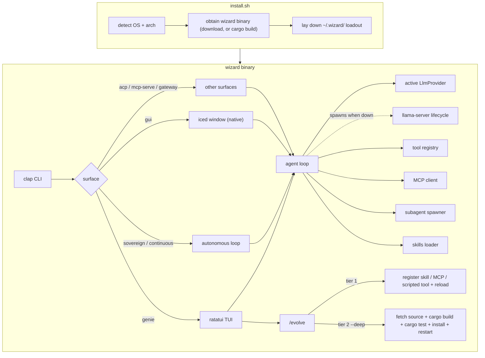

# Architecture

Wizard is a single-binary Rust application: a Ratatui TUI, a headless/sovereign loop, an iced window (`--features native`), and several other surfaces (ACP, MCP server, gateway, fleet, scheduler) on top of one provider-agnostic agent loop. The tool set is native tools plus MCP servers plus scripted tools, with tiered self-extension. Providers are interchangeable: any OpenAI-compatible endpoint, Anthropic, xAI (key or OAuth), ChatGPT OAuth, OpenRouter, Cloudflare Workers AI, Ollama, or a local llama.cpp server whose `llama-server` lifecycle Wizard manages itself.

## High-level overview



## Source layout

```
wizard/
├── src/
│   ├── main.rs / lib.rs     # entry, surface dispatch
│   ├── cli.rs               # clap argument parsing
│   ├── config.rs            # ~/.wizard/config.toml
│   ├── app/ / ui/ / event.rs / vim.rs
│   ├── agent/               # tool-calling loop, prompts, subagents, mission, ultra
│   ├── server.rs            # llama-server lifecycle
│   ├── llm/                 # LlmProvider + per-vendor clients (incl. fusion, oauth)
│   ├── mcp/                 # MCP client and mcp-serve server
│   ├── tools/               # native tools + registry + scripted + code mode (lua.rs, code.rs)
│   ├── evolve/              # tiered self-extension + publish
│   ├── gui/                 # the window's agent half: tasks, config store, git, OAuth (`native`)
│   ├── gateway/             # messaging bot (Telegram)
│   ├── fleet/               # parallel worktree workers
│   ├── mesh/                # peer discovery, QUIC transport, `wizard peers`
│   ├── graph/               # mesh graph model for the explorer
│   ├── commands/            # slash-command registry, shared by every surface
│   ├── platform/            # OS seams: paths, service units, secrets, locks
│   ├── schedule.rs          # cron-scheduled headless runs
│   ├── git_util.rs          # shared async git / worktree helpers
│   ├── hooks/               # pre/post tool hooks
│   ├── trust.rs             # per-project trust gate for project-shipped hooks
│   ├── logging.rs           # JSONL session log under ~/.wizard/logs (never stdio)
│   ├── doctor.rs            # environment checks + redacted bug-report bundles
│   ├── acp.rs               # Agent Client Protocol surface
│   ├── native/              # wizard gui (iced window, `native` feature)
│   ├── sync.rs              # signed config bundles
│   ├── memory.rs / checkpoint.rs / usage.rs / update.rs / …
│   └── skills/              # bundled skill loader
├── skills/                  # bundled skill definitions
├── loadout/                 # default mcp.toml + subagents
├── docs/
├── install.sh
└── install-byom.sh          # back-compat shim: install.sh with WIZARD_BYOM=1
```

## Components

### CLI (`cli.rs`)

Parses arguments and selects the surface:

| Flag / command | Purpose |
|------|---------|
| `--mode genie\|sovereign` | Personality |
| `-p, --prompt` | Initial task (headless or TUI pre-fill) |
| `--continuous` | Perpetual sovereign loop (implies sovereign) |
| `--plan` / `--omakase` | Start in plan mode / chef's-choice plan mode |
| `--evolve` / `--deep` | Self-extension mode |
| `--publish` | Fork-and-distribute |
| `--max-hours` / `--loop` | Sovereign run limits |
| `--gate` | Quality gate: a command that must exit 0 before a sovereign/continuous run may finish (repeatable) |
| `--cwd` | Project root override |
| `--bg` | Internal (hidden): marks a headless run dispatched from `/dashboard` |
| `--output-format text\|json\|stream-json` | Headless output |
| `wizard gui` | The iced window (needs `--features native`; `--native` is still accepted and ignored) |
| `wizard acp` | Agent Client Protocol over stdio |
| `wizard mcp-serve` | Expose native tools as an MCP server |
| `wizard agents` / `doctor` / `usage` / `sync` / `fleet` / `schedule` / `scheduler` / `gateway` / `peers` / `skills` / `harness` / `evolve` / `resume` / `update` / … | Utility subcommands (`update` exists but refuses every download today — see [Install scripts](#install-scripts)) |

### Config (`config.rs`)

Loaded from `~/.wizard/config.toml` with optional env overrides (`WIZARD_MODEL`, `WIZARD_LLAMACPP_HOST`, `WIZARD_GGUF_PATH`, `WIZARD_OLLAMA_HOST`):

```toml
active_provider = "local"
mode = "genie"
# 0 = no step limit: a turn runs until the model stops calling tools.
max_steps = 0

[[providers]]
name = "local"
kind = "llamacpp"
base_url = "http://127.0.0.1:11435"
model = "Qwen3.6-27B-Q4_K_M"
gguf_path = "/home/you/.wizard/models/Qwen3.6-27B-Q4_K_M.gguf"
```

When no `[[providers]]` are configured, Wizard synthesizes a local llama.cpp provider at `http://127.0.0.1:11435` (legacy `model` / `ollama_host`-only files included; Ollama is opt-in via an explicit `[[providers]]` entry). `WIZARD_OLLAMA_HOST` overrides `ollama_host` for explicit Ollama providers; it does not flip the synthesized default off llama.cpp.

At TUI startup, a missing or unstartable local backend is not fatal. Wizard falls back in order: any configured cloud provider, then one synthesized from known API key env vars, then interactive onboarding. The fallback becomes the session's active provider in memory; only onboarding writes config to disk.

### LLM clients (`llm/`)

All providers implement the `LlmProvider` trait (health, model listing, streaming chat, optional context-window probe). Clients include:

- `llamacpp.rs`: default local path; OpenAI-compatible `/v1` plus native `/health` and `/props`
- `openai.rs`: generic OpenAI-compatible endpoints
- `anthropic.rs`, `ollama.rs`, `openrouter.rs`, `xai` (via openai + oauth), `cloudflare.rs`
- `chatgpt.rs` / `chatgpt_oauth.rs`: ChatGPT subscription via Codex backend
- `fusion.rs`: multi-provider debate panel as one `LlmProvider`

Streaming tokens, native tool calls, and a prompt-based JSON fallback when the model lacks native tools all live behind the same trait.

### llama-server lifecycle (`server.rs`)

When the active provider is llama.cpp and nothing answers at its `base_url`, Wizard starts `llama-server` itself (TUI/headless/gateway startup and after `/provider use` switches to llamacpp). Requirements: the URL points at this machine, `llama-server` is on `PATH`, and the provider's `gguf_path` exists. The child is detached in its own process group, logs to `~/.wizard/llama-server.log`, and records its PID in `~/.wizard/llama-server.pid`. Readiness is polled at `GET /health` for up to 60 s. `/server status|start|stop` manages it from the TUI; `stop` verifies the recorded PID is still a `llama-server` before signalling.

### Agent loop (`agent/turn.rs`)

```
┌─────────────────────────────────────────┐
│  1. Build message list                  │
│     system prompt + skills + history    │
│  2. Stream completion from the provider │
│  3. Parse tool calls from response      │
│  4. Execute tools → append results      │
│  5. Repeat until the model is done      │
└─────────────────────────────────────────┘
```

A turn runs until the model stops calling tools. `max_steps = 0` (the default) puts no ceiling on that; a positive `max_steps` caps the round trips. A turn is also bounded by a user interrupt or the sovereign loop-control file, the `--max-hours` limit, and the circuit breaker after repeated identical failures.

Sessions append to `~/.wizard/sessions/<timestamp>.jsonl` after each turn. Auto-compaction and the agent's native `compact` tool shrink in-memory history while leaving the JSONL intact (the progress note is also appended as a system note). See [Agent-managed context](usage.md#agent-managed-context).

Genie is the interactive TUI personality. Sovereign is headless autonomy for one task. Continuous (`--continuous`) is perpetual sovereign: durable mission under `<project>/.wizard/mission.toml`, sleep-and-wake on provider blips, context compaction, and re-exec after evolve. Details in [modes.md](modes.md).

### Images

Images move through the loop in both directions. A tool returns them on `ToolOutput`; a model generates them and the provider emits them on the stream. The agent takes custody in `agent::absorb_images`: drops anything over the size cap, writes the rest to `~/.wizard/images/<session>/<content-hash>.<ext>`, and announces `AgentEvent::Images` (path, media type, size; never base64 on the wire to the UI).

Base64 stays on the `ChatMessage` in history for vision models. A tool's images ride back to the model on a following user message, not on the tool result (OpenAI's tool role takes no image blocks).

### Tools (`tools/`)

| Tool | Description |
|------|-------------|
| `read_file` | Read file contents with optional line range |
| `write_file` | Create or overwrite a file |
| `edit_file` | Search-and-replace edit |
| `list_files` | Directory listing with glob filter |
| `search_files` | Ripgrep/grep content search |
| `execute` | Run shell command with timeout; `run_in_background` detaches ([tasks.md](tasks.md)) |
| `git_status` / `git_diff` | Working tree status and diffs |
| `web_fetch` / `web_search` / `x_search` | HTTP fetch, web search, and X/Twitter search ([web.md](web.md)) |
| `generate_image` | Image generation ([image.md](image.md)) |
| `memory` / `todo` | Durable project memory and working todo list |
| `manual` | Read one section of the charter (`WIZARD.md`) in full; the system prompt carries only its index |
| `task_output` / `task_kill` | Background shell task controls |
| `subagent_status` / `subagent_kill` | Background subagent controls |
| `run_command` | Queue a Wizard slash command for the attached surface ([usage.md](usage.md#agent-run-slash-commands)) |
| `compact` | Summarize older history mid-turn on every surface ([usage.md](usage.md#agent-managed-context)) |
| `spawn_subagent` | Fan out work to a named subagent (agent registry, not mcp-serve) |
| `run_code` | Run a LuaJIT program that calls Wizard's own tools; off by default ([code-mode.md](code-mode.md)) |
| `exit_plan` / `interview` | Plan-mode completion and clarifying questions |
| `evolve` / `publish` | Self-extension and fork-and-distribute |

There is no per-action y/n gate outside plan mode and hooks. Genie is conversational; sovereign/continuous run unattended. Plan mode keeps non-read-only tools blocked until `exit_plan` is approved (or omakase auto-approves).

Beyond the built-ins, the registry also serves scripted tools (`~/.wizard/tools/`, default runtime **embedded LuaJIT**) and MCP tools. All three kinds present the same interface to the agent loop.

`run_code` is the ad hoc form of the same idea: one Lua program per call, with a bridge back into `dispatch.rs` so every tool it calls is hooked, snapshotted and post-hooked exactly like a direct call. Nothing survives the call, and it is registered only when `code_mode = true` **and** the model calls tools natively. See [code-mode.md](code-mode.md).

### MCP (`mcp/`)

Wizard is both an MCP client and an MCP server:

- **Client:** servers in `~/.wizard/mcp.toml` (stdio or HTTP). On startup and `/reload`, tools are listed and merged into the registry. This is the path for browser control, databases, search, and similar. (Computer use is not one of them: `computer` is a native tool.)
- **Server:** `wizard mcp-serve` exposes the native tool set over stdio. See [mcp.md](mcp.md).

### Mesh (`mesh/`, `graph/`)

Peer-to-peer visibility between your own machines: discovery, a QUIC transport with per-peer trust, and `wizard peers` to list, trust, and watch them. It is an **observation** layer — a peer's turn arrives as an event you can watch. (The graph explorer that draws it is deferred and unreachable in 2.0; see [graph-explorer.md](graph-explorer.md).) It does not distribute work: there is no task frame on the wire and nothing in a shipping path hands a peer a job. See [mesh.md](mesh.md). Nothing accepts a connection until `[mesh] listen` is configured.

### Subagents (`agent/subagent.rs`)

Isolated workers for parallel or decomposed work:

- Each subagent gets its own history and tool scope, and a 50-step ceiling unless its file sets `max_steps` (`0` = no ceiling)
- Results return to the parent as one tool result
- `spawn_subagent` can detach (`background: true`); the report lands when finished
- Runs emit `SubagentRun*` events; the TUI demuxes them onto the [subagent rail](usage.md#the-subagent-rail)
- Fleet mode coordinates parallel workers over git worktrees ([fleet.md](fleet.md))

### Skills (`skills/`)

Markdown files with frontmatter. The system prompt carries each skill's name, description, and path; the body is read from disk when the skill matches. A skill may set `always: true` to inline its body. Loaded at startup and on `/reload`. Bundled skills live under the repo's `skills/`; user skills under `~/.wizard/skills/`.

### Self-extension (`evolve/`)

Triggered by `/evolve`, the `evolve` tool, or `--evolve` on the CLI. Two tiers; full walkthrough in [evolve.md](evolve.md).

**Tier 1 (runtime, default).** Skill, MCP server, scripted tool, or subagent under `~/.wizard/`, activated by `/reload`.

**Tier 2 (deep, `--deep`).**

1. Locate source at `~/.wizard/src` (clone on first use; `WIZARD_SOURCE_REPO` overrides the URL)
2. Ensure a Rust toolchain (`rustup --profile minimal` if needed)
3. Propose a unified diff (file-selection turn, then diff-authoring turn)
4. Clear the gate: `cargo build --release --locked`, then `cargo test --release --locked` (bounded by `WIZARD_EVOLVE_TEST_TIMEOUT_SECS`, 45 min default), then a `--version` smoke test. `--locked` is on the build because that is the first cargo invocation to touch `Cargo.lock`. Any rung failing reverts the diff and logs the failure
5. Install over the running binary (keep `<name>.prev`). No `sudo` escalation here: an unwritable install path fails the evolve after the source commit, naming the built binary and the `sudo install` command to finish by hand
6. Restart into the new binary when the surface supports it (CLI `exec`-replace, continuous re-exec marker; interactive sessions report and expect a restart)

Evolution events go to `~/.wizard/evolution.jsonl`. `/publish` pushes `~/.wizard/src` to a GitHub fork ([market.md](market.md)).

### Surfaces

- **TUI** (`app/`, `ui/`, `event.rs`): chat, tool cards, git sidebar, subagent rail, status bar, slash commands
- **Headless** (`agent` + `output.rs`): text / JSON / stream-json ([headless.md](headless.md))
- **Window** (`src/native/` drawing, `src/gui/` holding the agent; both `--features native`): the same agent core in-process, in an iced window — no HTTP, no webview, no port ([native-gui.md](native-gui.md)). There is no browser GUI: the loopback HTTP server and JavaScript page that used to be the second surface are deleted. A headless box is reached by running the TUI over SSH, by `wizard -p`, by `wizard acp`, or through the gateway
- **ACP** (`acp.rs`): editor embedding ([acp.md](acp.md)); also the surface Buzz and other ACP harnesses drive ([buzz.md](buzz.md))
- **Gateway** (`gateway/`): Telegram bot turns ([gateway.md](gateway.md))
- **Fleet / schedule / sync / doctor / update**: see the matching docs pages

## Data on disk

| Path | Contents |
|------|----------|
| `~/.wizard/config.toml` | User configuration |
| `~/.wizard/credentials.toml` | API keys (mode 0600) |
| `~/.wizard/xai_oauth.json` / `chatgpt_oauth.json` | OAuth sessions (created mode 0600; `wizard doctor`'s secret-storage check reports one that is loose anyway) |
| `~/.wizard/models/*.gguf` | Downloaded GGUF model files |
| `~/.wizard/llama.cpp/` | llama.cpp release tree from the installer |
| `~/.wizard/llama-server.log` / `.pid` | Managed llama-server |
| `~/.wizard/mcp.toml` | MCP server declarations |
| `~/.wizard/schedule.toml` / `scheduler.lock` | Cron entries, and the daemon's single-instance lock |
| `~/.wizard/subagents/*.toml` | Subagent definitions |
| `~/.wizard/tools/` | Agent-authored scripted tools (LuaJIT by default) |
| `~/.wizard/src/` | Source checkout for deep evolve |
| `~/.wizard/sessions/*.jsonl` | Chat history |
| `~/.wizard/memory/<project>/` | Durable project memory |
| `~/.wizard/images/<session>/` | Session images |
| `~/.wizard/evolution.jsonl` | Self-extension / publish log |
| `~/.wizard/usage.jsonl` | Token usage log |
| `~/.wizard/running/` | Live session heartbeats for `wizard agents` |
| `~/.wizard/sync/` | Sync key, trusted keys, pull backups |
| `~/.wizard/trusted_projects` | Per-project trust decisions for project hooks (mode 0600) |
| `~/.wizard/logs/` | Per-process JSONL diagnostic logs, filtered by `WIZARD_LOG` ([logging.md](logging.md)) |
| `~/.wizard/bundles/` | `wizard doctor --bundle` bug-report bundles (mode 0700) |
| `<project>/.wizard/loop-control` | Sovereign/continuous run control |
| `<project>/.wizard/mission.toml` | Continuous-mode durable mission |
| `<project>/.wizard/plan.md` | Last plan-mode plan |
| `<project>/.wizard/checkpoints/` | Per-file edit snapshots for `/rewind` |
| `<project>/.wizard/fleet/` | Fleet queue, results, worktrees, logs ([fleet.md](fleet.md)) |

## Install scripts

### `install.sh`

By default: binary + [default loadout](loadout.md) (browser MCP + subagents). No model, no config, no Rust toolchain. First `wizard` run opens onboarding.

**The download path verifies before it installs.** `install.sh` and `wizard update` both check `checksums.txt` against its minisign signature under `wizard-release.pub`, then each asset's sha256 against that file, and every failure aborts. The check comes first, before any flavor does its work, so a refusal costs about a second rather than a multi-gigabyte GGUF. `WIZARD_BUILD_FROM_SOURCE=1` (implied on Termux) builds from the tag instead, along with Nix and a plain checkout. Details in [Getting started](getting-started.md#install).

Flavors: `WIZARD_LOCAL=1` preinstalls the local stack; `WIZARD_USE_OLLAMA=1` is the Ollama variant of that flavor; `WIZARD_BYOM=1` sets up Ollama and defers the model choice; `WIZARD_MINIMAL=1` is binary only (`WIZARD_BESPOKE=1` is a deprecated alias). `WIZARD_NATIVE=1` additionally installs `wizard-native`, the build with the iced window. Deep-evolve toolchain installs on first `/evolve --deep`, or eagerly with `WIZARD_WITH_TOOLCHAIN=1`.

### `install-byom.sh`

Back-compat shim: downloads `install.sh` and runs it with `WIZARD_BYOM=1`.

## Dependencies

| Crate | Role |
|-------|------|
| `ratatui` + `crossterm` | Terminal UI |
| `tokio` | Async runtime |
| `reqwest` | Provider HTTP |
| `clap` | CLI parsing |
| `serde` / `serde_json` | Serialization |
| `toml` + `dirs` | Config |
| `syntect` | Syntax highlighting in diffs |

Target release binary: well under 60 MB stripped (current builds are much smaller).

## Security model

- Inference goes to the active provider and nowhere else
- Beyond the active provider, the core makes outbound calls only for things you invoke or configure: native web tools, the messaging gateway, model download at install, deep evolve's source clone, the skills registry (`wizard skills`), `wizard sync pull` from a URL, `wizard update`'s release check, and the mesh's QUIC dials to peers you gave routes for. MCP servers and scripted tools you add can make their own calls; they run with your privileges
- The `execute` tool runs real shell commands and cannot be confined to the working directory. Treat tool execution as full local access
- There is no per-action y/n gate outside plan mode and hooks. Genie is interactive; sovereign runs one task unattended; continuous is perpetual. Prefer a container or VM for untrusted work. Full threat model in [SECURITY.md](../SECURITY.md)
- A project's own `.wizard/hooks.toml` loads only after a recorded per-project trust decision (`~/.wizard/trusted_projects`); with no terminal to ask on, it is refused unless `WIZARD_TRUST_PROJECT=1` opts that one process in, and a recorded refusal outranks even that. See [hooks.md](hooks.md#project-trust)

## Roadmap-shaped ideas

Not commitments, just directions that have come up:

- Plugin marketplace (dynamic `.so` / WASM)
- Richer ACP surface (images, todos, subagent events)
- Deeper window parity with every TUI command
